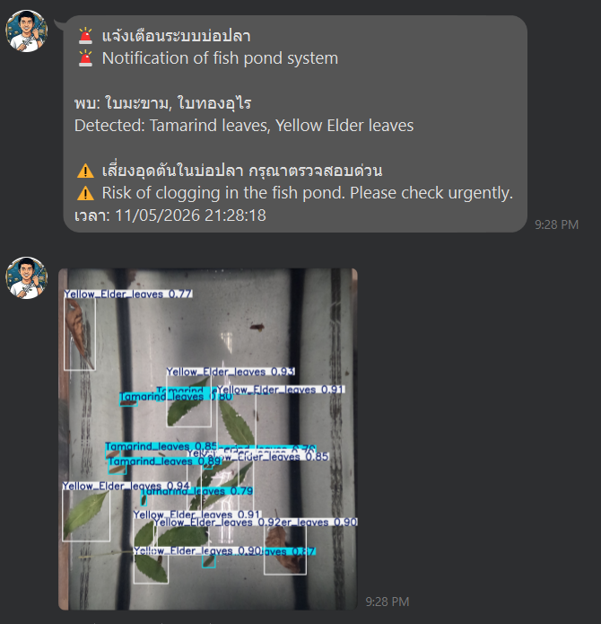

# 🍃 Floating AI Robot for Automatic Pond Leaf Detection




A fully integrated **Floating Robotic Platform** equipped with a real-time AI vision system to monitor and detect falling leaves on a water surface. Designed to prevent water pollution and filter clogging, this system utilizes a GoPro camera, YOLOv8 object detection, and IoT communication for smart alerting.

## ✨ Key Features & Workflow

* **Autonomous Floating Platform:** The system is mounted on a robotic platform utilizing a **Jetson Nano** to control movement via 4 water pumps and navigates using an **RPLidar** sensor.
* **Energy Efficient Monitoring:** Instead of continuous heavy video processing, the GoPro captures and transmits high-quality images every **5 minutes**, significantly reducing computational load and power consumption.
* **Highly Accurate AI Detection:** Powered by a custom-trained **YOLOv8** model running on Google Colab, achieving an overall accuracy (mAP50) of **84%**.
* **Smart Notification Logic (LINE Notify):** * **Alert Mode (Large Leaves):** Immediate LINE alerts are triggered when leaves that pose a clogging risk (Mango: 87% accuracy, Yellow Elder: 86% accuracy) are detected.
  * **Logging Mode (Small Leaves):** Small debris like Tamarind leaves (82% accuracy) are silently logged via a **Custom Tkinter GUI** to prevent alert fatigue.
* **Sustainable Power System:** Powered by a 12V DC battery with a step-down converter, supplemented by an onboard **Solar Panel** for extended operational time.

## 🛠️ System Architecture (Hardware & Software)

1. **Vision Sensor:** GoPro Hero 11 Black (Captures water surface images).
2. **Main Hub & Movement Controller:** NVIDIA Jetson Nano.
3. **IoT Alert Unit:** Raspberry Pi Zero 2W (Handles data buffering and LINE API communication).
4. **Remote Computing:** Google Colab (Executes the YOLOv8 inference engine).
5. **Local GUI Interface:** Developed with Custom Tkinter for real-time visual monitoring.

## 📊 Dataset & Model Performance
* The YOLOv8 model was trained on a custom dataset of **1,000 real-world images**, capturing both dry and fresh leaves under varying lighting conditions, orientations, and water reflections.
* Peak model accuracy stabilized at **0.837 (84%)** after 100 epochs, demonstrating robust generalization against water ripples and shadows.

## 🚀 Getting Started

### Prerequisites
* Python 3.8+
* Ultralytics (YOLOv8), OpenCV, CustomTkinter
* LINE Notify Token

### Installation
Clone this repository:
   ```bash
   git clone [https://github.com/JoNE5Roi/Pond-Leaf-Detection-YOLOv8.git](https://github.com/JoNE5Roi/Pond-Leaf-Detection-YOLOv8.git)
